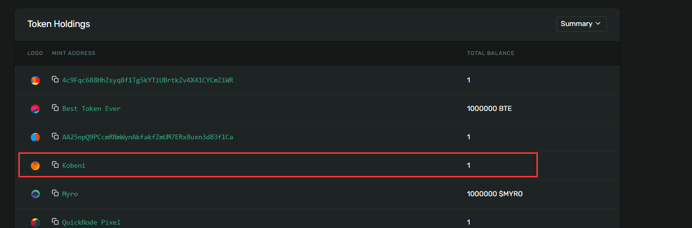
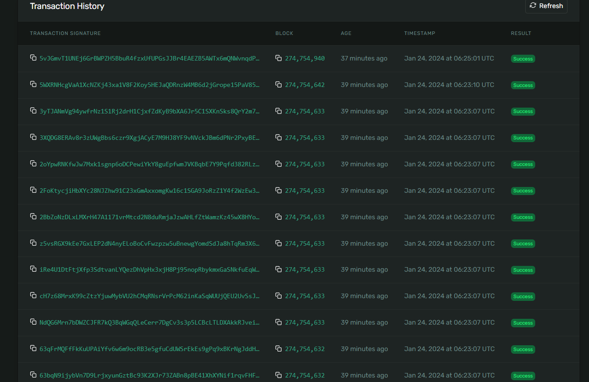
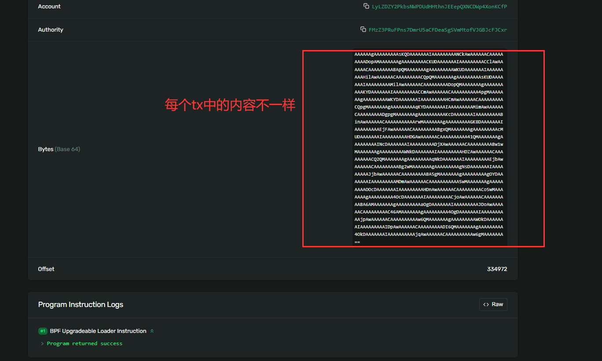
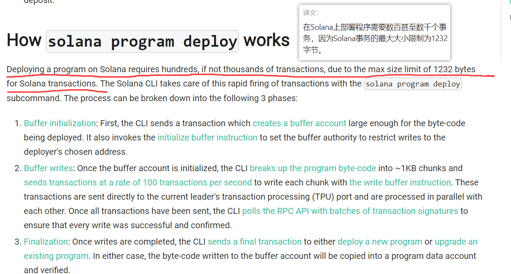

# Solana-NFT-Anchor

This project shows how to mint your first NFT on the Solana blockchain using [Anchor](https://www.anchor-lang.com/) and [Metaplex](https://www.anchor-lang.com/).

## Specifications

```
Windows 11 in wsl2: Ubuntu 20.04
anchor-cli 0.28.0
solana-cli 1.16.28 (src:8a9f5026; feat:2294205250, client:SolanaLabs)
```

## Getting Started

1. Clone the repo

```bash
git clone this repo
```

2. Change directory into the root of your cloned repo and install missing node packages

```bash
yarn install
```

**NOTE:** You must use yarn to install the dependencies. If you use a different package manager, you will run into issues minting the NFT.

3. Build your anchor project.

```bash
anchor build
```

4. List the project deployment keys and copy the address to a clipboard

```bash
anchor keys list
```

5. Update your [`Anchor.toml`](Anchor.toml) file, by using the address generated in the previous step. 

```toml
[programs.devnet]
solana_nft_anchor = "<UPDATE HERE>"

[provider]
# what I use: https://quiet-young-pallet.solana-devnet.quiknode.pro/???
cluster = "<Devnet rpc>"
wallet = "/home/<Your username>/.config/solana/id.json"
```

6. Update your [`lib.rs`](programs/solana-nft-anchor/src//lib.rs) file by adding the the address generated in step 4 to the `declare_id!()` macro

```rust
    // snip
use mpl_token_metadata::{
    pda::{find_master_edition_account, find_metadata_account},
    state::DataV2,
};

declare_id!("<UPDATE HERE>");
#[program]
pub mod solana_nft_anchor {
    // snip
```

7. Build your anchor project again

```bash
anchor build
```

8. Deploy the program

```bash
anchor deploy
```

9. Finally, u can check the result in the solana explorer after running: 

```
anchor run test
```

## 坑&理解

结果：



但是可以看到，我们`anchor deploy`的时候部署了300+的交易：



大部分交易都是这个：



为什么部署一个NFT需要这么多交易呢？[原因](https://docs.solana.com/developing/on-chain-programs/deploying)如下：



Solana限制Program大小，然后部署的这个NFT会被分成多个TX，分片的写入链上，因此非常多比交易。（我觉得Solana这么设计非常不好，这么多交易，到后期用户很难分辨和分类出来哪些交易是干嘛用的）

非常多的tx都是这个内容，其中Bytes (Base 64)的内容不一样，也就是说每次都向链上写不同的内容，最终300+笔交易，合成了最终的NFT program
